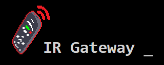
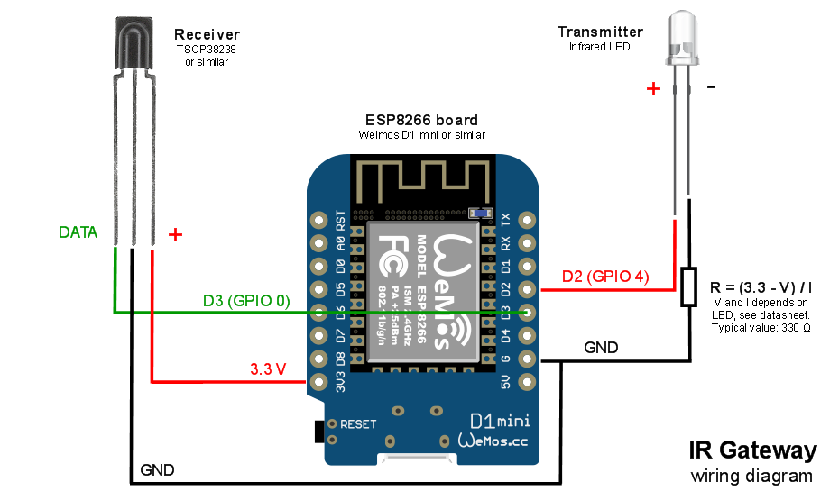

IR-Gateway is an ESP8266 project allowing to acquire and send infrared commands using an HTTP REST API, based on the [Arduino-IRremote](https://github.com/Arduino-IRremote/Arduino-IRremote) project.

## Setting Up

### Material needed

The following material is needed for this project:
* An ESP8266-based board such as Weimos D1 Mini
* IR Receiver Module such as TSOP38238
* IR LED with adequate resistor
* Some power supply for the ESP8266
* [D1 Mini 3D printed case](https://www.thingiverse.com/thing:6554067) _(optional)_

### Wiring

Wire components as shown in the diagram below:



It is possible to make a Receive-only gateway or a Transmit-only gateway by omitting the other component.

### Firmware

Using [Arduino IDE](https://www.arduino.cc/en/software), install the following dependencies:
* [WiFiManager](https://github.com/tzapu/WiFiManager)
* [Arduino-IRremote](https://github.com/Arduino-IRremote/Arduino-IRremote)
* [ESPWebServer](https://github.com/esp8266/ESPWebServer)

Then open IR-Gateway.ino, select your board and flash the program. You can flash IR-Gateway as-is and configure Wi-Fi using Wi-Fi manager. On first boot, the board will start in Wi-Fi hotspot mode. Connect to it using a smartphone or computer, then select your Wi-Fi network and enter the password. The board will save settings and connect to that network. In case the Wi-Fi network is unreachable, it will switch back to configuration mode. See [Wi-Fi Manager](https://github.com/tzapu/WiFiManager?tab=readme-ov-file#how-it-works) for more details.

If you prefer hardcoded Wi-Fi credentials, you can edit the Wi-Fi configuration before flashing:

```C
//#define USE_WIFI_MANAGER // Comment this to use hardcoded credentials
const char* wifi_ssid   = "MyWyFiNetwork";
const char* wifi_pass   = "S3cr3tWiFiP4ssw0rd";
```

In this mode, the board will try reconnecting endlessly instead of switching back to configuration mode, but you'll need to reflash it in order to change Wi-Fi settings.

## Usage

The gateway offers two HTTP REST API endpoints:

### /ir/send

* Sends NEC IR Command
* Method: GET
* Arguments:
  * `address` (int): IR Device Address
  * `command` (int): IR Device Command
* Status codes:
  * `200`: Command Sent
  * `400`: Invalid arguments

Example GET request:
```
http://ip.of.gate.way/ir/send?address=0&command=0
```

Example JSON response:
```json
{"success": true, "message": "Sending Command", "address": 0, "command": 0}
```

### /ir/receive

* Capture NEC IR Command
* Method: GET
* Reponse body:
  * `address` (int): IR Device Address
  * `command` (int): IR Device Command
* Status codes:
  * `200`: Command Received
  * `504`: Timed out (10 seconds with no observed IR command)

Example GET request:
```
http://ip.of.gate.way/ir/receive
```

Example JSON response:
```json
{"success": true, "message": "Received Command", "address": 0, "command": 0}
```

### Limitations

Sending is disabled while receiving, the service is single-threaded. The Receive API is intended as a mean of retrieving codes from an infrared remote, then emulating them using the Send API. However, a receive-only gateway is possible by polling the API in a loop from another program.

## License

IR-Gateway is provided under
[CDDL-1.0](http://opensource.org/licenses/CDDL-1.0)
([Why?](http://qstuff.blogspot.fr/2007/04/why-cddl.html)).

Basically, you can use it or its source for any project, free or commercial, but if you improve it or fix issues,
the license requires you to contribute back by submitting a pull request with your improved version of the code.
Also, credit must be given to the original project, and license notices may not be removed from the code.